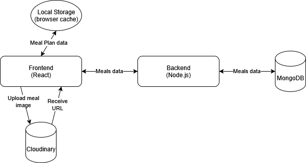

# 🥗 Meal Planner App

A full-stack meal planning web app that allows users to:

- Create and edit meals with categorized ingredients
- Store and manage meals via a backend API (MongoDB)
- Save weekly meal plans using browser local storage
- Upload meal images via Cloudinary

---

## 🚀 Tech Stack

### Frontend
- React + Vite
- React Router
- Local Storage (for meal plan caching)
- Cloudinary API (for image uploads)

### Backend
- Node.js + Express
- MongoDB (meals data)

---

## 📊 System Architecture

---

## 📦 Features

- ✅ Add new meals with ingredient categories (Breakfast, Lunch, etc.)
- ✅ Edit or delete existing meals
- ✅ Upload and display meal images
- ✅ Plan meals for each day of the week
- ✅ Local caching of user’s meal plan (no login required)